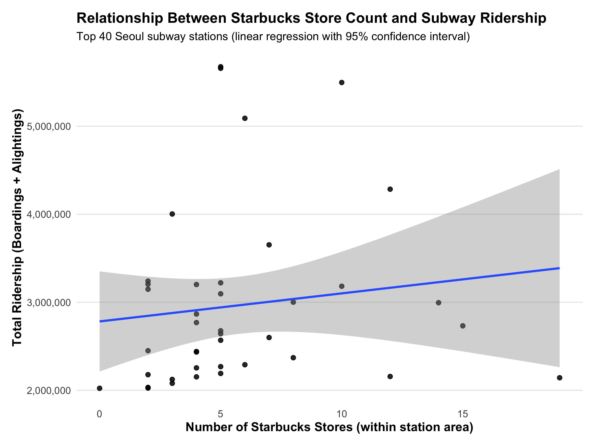

# Subway Ridership vs. Starbucks Stores in Seoul

## Abstract
This project explores whether higher subway station usage in Seoul is associated with a higher concentration of nearby Starbucks stores. Using October 2023 station-level ridership data and Starbucks locations within a 500m radius of each station, I evaluate the relationship via exploratory mapping, top/bottom comparisons, and statistical tests (linear regression and ANOVA). 

## Problem
**Hypothesis:** Stations with higher total ridership (boardings + alightings) have more Starbucks stores nearby.

## Approach
- **Data preparation**
  - Ridership: Seoul Open Data Plaza (Oct 2023 station-by-line ridership) + station address dataset for filtering Seoul-only stations.
  - Starbucks: store addresses collected from Starbucks’ store locator, converted to coordinates with a geocoding tool, and counted within **500m buffers** around station locations in QGIS.
  
- **Analysis workflow**
  1. Map the spatial distribution of stations and Starbucks stores in Seoul (EDA).
  2. Compare Starbucks counts for **top 10 vs bottom 10** stations by total ridership. 
  3. Because the bottom-10 sample had too few Starbucks stores for robust modeling, expand to **top 40 stations** and run:
     - linear regression (ridership ~ Starbucks count) and
     - ANOVA across four ridership-ranked groups (10 stations per group).

## Key Findings
- **Top 10 vs bottom 10 context:** top stations recorded roughly **3.0–5.5M** monthly board+alight events, while bottom stations were around **60K–140K**.{index=9}  
- **Regression on top 40:** the linear relationship between total ridership and nearby Starbucks count was **not statistically significant** (R-squared ≈ **0.016**, p-value ≈ **0.433**).  
- **Group differences (ANOVA):** when the top 40 stations were grouped by ridership rank, ANOVA indicated **significant differences between groups** (F ≈ **34.22**, p < 0.05).  
  - Post-hoc results highlighted that the **top 1–10 group** differed significantly from the other groups.

## Code
- `R/00_setup.R`: Loads required libraries, sets up fonts (optional), defines helper utilities, and creates the output directory (`figures/`) for saving plots.
- `R/01_prepare_and_eda.R`: Loads raw Oct 2023 subway ridership data, computes line/station aggregates, performs exploratory analysis (Top/Bottom comparisons), and saves key EDA figures to `figures/`.
- `R/02_modeling.R`: Builds the Top-40 station analysis dataset, runs the main statistical analyses (linear regression and ANOVA), and saves the README-ready regression figure as `figures/ridership_starbucks_regression.png`.

## Tools and Libraries
- **R / RStudio (4.3.2)**
- R packages used in the analysis (as seen in the code/report workflow): `ggplot2`, `dplyr`, `extrafont` (plus base R stats).  
- External preprocessing tools used for spatial preparation: **GeocodingTool** (address → coordinates) and **QGIS** (500m buffer counting).

## Contribution
- Data cleaning/aggregation, exploratory visualizations, statistical testing (linear regression + ANOVA), and interpretation of results.  
- Seoul Open Data Plaza (Oct 2023 subway ridership dataset)
- Starbucks Korea store locator (store addresses)
